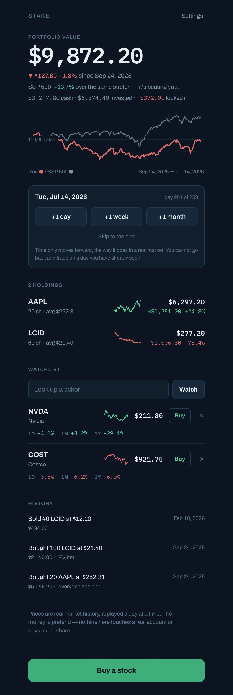

# Stake

**A stock market simulator for middle and high school students.**

You start with pretend money on a September morning in 2025. You buy real stocks at the prices they actually traded at. Then you move time forward, one day at a time, and find out what the market did next.

The money is imaginary. Everything else is real.

<p align="center">
  
</p>

---

## What makes it a simulator

Most "stock apps" a student can find are portfolio *trackers*: you type in what you already own and it adds up the numbers. Nothing is at stake, so there is nothing to learn.

Stake works the way a brokerage does:

- You start with **cash** — you choose how much.
- **Buying costs money.** Ten shares at $252.31 takes $2,523.10 out of your cash, and you cannot spend what you do not have.
- **Selling returns money**, and locks in whatever you gained or lost.
- **Prices move on their own.** You do not type them in. They change because that is what the market did that day.

That last point is the whole thing. A position you bought on Tuesday is worth something different on Wednesday, and you had no way of knowing which way it would go.

## The replay

The simulation begins on **Wednesday, 24 September 2025** and runs forward through **253 trading days** — one full year of real market history, ending at the present.

You move through it with **+1 day**, **+1 week**, **+1 month**, or **Skip to the end**. Every price you see is that day's actual closing price.

### Why you cannot go back

There is no rewind button, and that is deliberate.

If you could go back, you could advance a day, notice a stock fell, return to yesterday and sell before the drop. Every decision would be made with hindsight, and your final number would mean nothing.

To look at the past, scrub the chart with your cursor or read the **History** list. What you cannot do is un-know the future — which is exactly the constraint that makes the result worth something.

## What you can do

**Buy and sell.** Search 117 companies by ticker or name. The sheet shows the live price, what your order costs, and how much cash you would have left. If you cannot afford it, it tells you your maximum instead of just refusing.

**Watch before you buy.** Add tickers to a watchlist to see their 1-day, 1-month and 1-year performance alongside a sparkline, without committing anything.

**Open any stock.** Tap a ticker for its own chart with **1M / 6M / 1Y / Max** ranges, going back as far as September 2021.

**See how you are really doing.** The headline chart draws your portfolio against *what the same starting cash would be worth in the S&P 500*. Both lines are in dollars on one scale, so the comparison is honest — and it is frequently humbling:

> Portfolio: **+9.7%** · The S&P 500 is **+16.7%** over the same stretch — it's beating you.

Beating the market is hard. Discovering that for yourself, with a year of real data, is the most useful thing this app can teach.

**Record why.** Each purchase takes an optional note — *"everyone has an iPhone"*, *"EV bet"* — stored with the trade. Reading your own reasoning back a simulated year later is where the lesson lands.

## Running it

Open `stake.html` in a browser. That is the whole installation.

To serve it locally instead:

```bash
python3 -m http.server
# then open http://localhost:8000/stake.html
```

There is nothing to install, no build step, no account, no API key, and **no network connection required** — the price history is baked into the file. Your progress is saved in that browser.

## The data

**117 companies and funds · 1,272 trading days · 1 September 2021 → 25 September 2026**

Real daily closing prices from Nasdaq, stored in the file as integer cents against a shared trading-day calendar. The replay starts with four years of history behind it, so the longer chart ranges have something real to show, and one year ahead of it to play.

Prices are fixed at the day they were fetched. That is a deliberate trade: the app works instantly, offline, forever, with no signup — at the cost of not extending past September 2026. Refreshing the dataset is a build-time step, not something the app does at runtime.

> A note on why: a web page can only fetch from servers that explicitly allow it. No dependable free stock API does, without a key. But that restriction applies to *browsers*, not to a script run on a machine — so the prices were fetched once, up front, and written into the page.

## Layout

```
stake.html                 the entire app: markup, styles, logic and price data
tests/                     64 tests, run with Node, no network
  portfolio.test.js          cash, positions, average cost, realised gains
  replay.test.js             chart ranges and the clock calendar
  buy.test.js  sell.test.js  the trading flows
  clock.test.js              moving through the replay
  chart.test.js  detail.test.js  the charts
  harness.js                 a small DOM shim that runs stake.html under Node
docs/                      design notes and decisions
CLAUDE.md                  guidance for working on the code
```

## Tests

```bash
node --test tests/*.test.js
```

Everything runs offline in about a third of a second. The pure logic — cash, average cost, realised gains, date maths — is tested directly. The trading flows are driven through `tests/harness.js`, a small DOM shim that runs the real `stake.html` under Node, so buying, selling and advancing the clock are exercised without a browser.

## Notes on the design

**Average cost, not FIFO.** Buy 5 shares at $10 and 5 at $20 and your cost is $15 a share. Real brokerages often use first-in-first-out; average cost is explainable to a twelve-year-old, which matters more here.

**Whole shares only.** "I can only afford 17 shares" is itself part of the lesson.

**Trades execute at the daily close.** Fine-grained intraday data would add noise without adding understanding.

**Every trade is kept, and nothing else is.** The trade log is the only thing stored. Your cash, positions, average cost and gains are all recalculated from it. That means "how did I get here?" always has an answer.

**Gains and losses never rely on colour alone.** Every figure carries a `+`, `−`, `▲` or `▼`, and the palette was checked against colour-vision simulations rather than by eye.

---

*The money is pretend. Nothing in this app connects to a real account, and it cannot buy a real share. It is not investment advice.*
